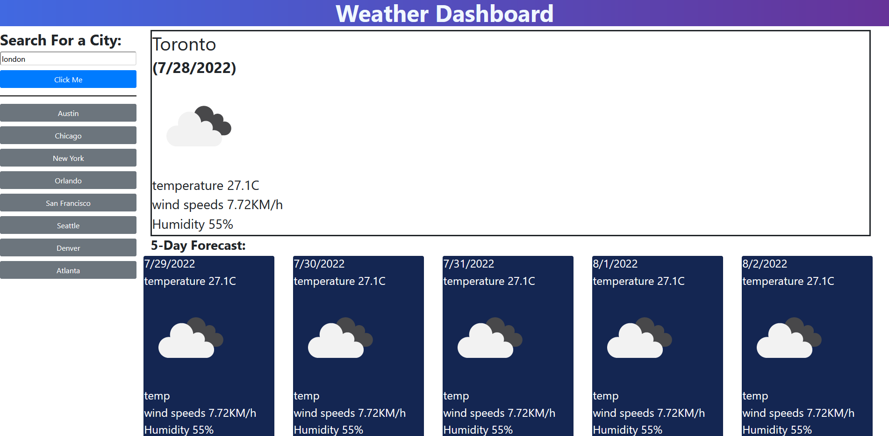

# Weather App

## Summary

This is both my challenge 6 assignment, a quick weather app that tells you the weather of any city you search up, and its up coming weather

## Table of Contents

- [Installation](#installation)
- [Usage](#usage)
- [Contact](#contact-info)

---
 
---

## Installation

Clone the repo onto your local drive, ```git clone git@github.com:sw33ws/jubilant-memory.git```

## Usage

First open it in vs code, then open it in the your browser, with a addon like ```open in browser, by TechER```.

You can also use the finished website here [here](https://sw33ws.github.io/jubilant-memory/)

## Contact Info

https://github.com/sw33ws
